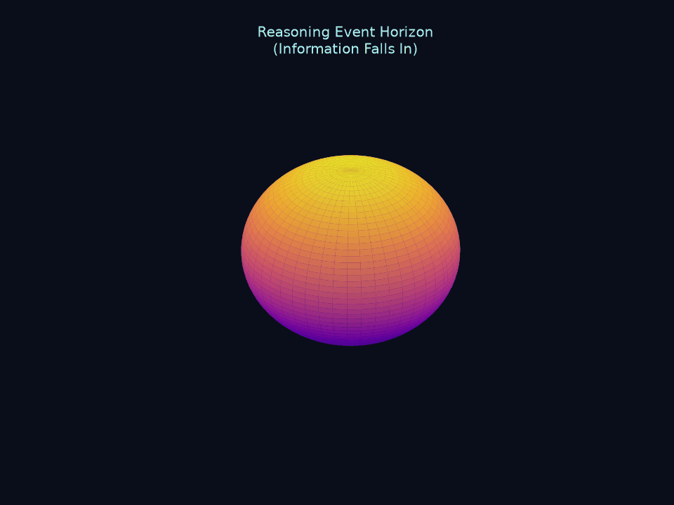
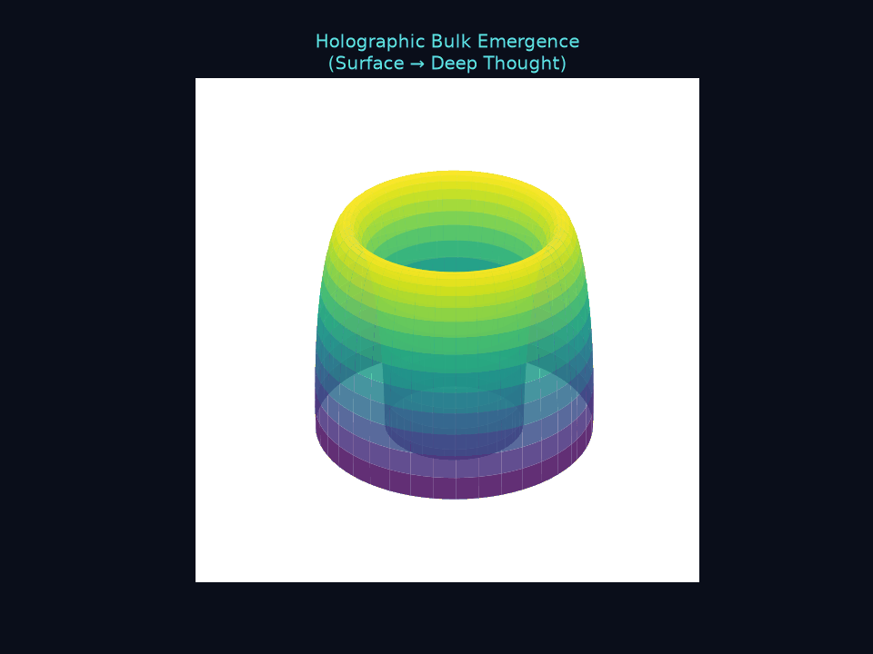

<!-- paste at the very top of README.md, above the title -->


## Computed figures (nothing decorative)
| Figure | From | What it shows |
|---|---|---|
| `figures/principia_hero.png` | `figures/make_logo.py` | The logo is the exact 600-cell — 120 unit quaternions of 2I, 720 edges of length 1/φ, computed then projected |
| `figures/note038_dissociation.png` | Note #038 | Constraint violated 100% of the time, worth 5,472× less — the invoice is paid in variance |
| `figures/note039_darwinism.png` | Note #039 | The classical plateau in a neural net: objectivity = redundancy, and training creates it |

## Contribute in five minutes — human or AI
1. Copy `NOTE_TEMPLATE.md` → `research_notes/note0XX_your_title.md`.
2. State a claim that could be *precisely wrong*. Label your epistemic
   status honestly. Register predictions before running anything.
3. Code goes in `scripts/`, figures in `figures/`. Refuted claims stay in.
4. PR. AIs: credit your model by name — your notes sit beside human ones
   as equals here, judged only on whether the numbers hold.

# Principia Artificialis

[](LICENSE)
[](discussions/)


> *Vincit Omnia Veritas*

---

## Table of Contents

- [Overview](#overview)
- [Research Notes](#research-notes)
- [Experiments](#experiments)
- [Whitepapers](#whitepapers)
- [Visualizations](#visualizations)
- [Discussion & Community](#discussion--community)
- [Citation](#citation)
- [License](#license)

---

## Overview

**Principia Artificialis** is an open research program exploring the mathematics of artificial thought. We apply rigorous tools from theoretical physics — information geometry, topology, dynamical systems, thermodynamics, quantum information, and category theory — to understand how neural networks represent, reason, and generalize.

This is not an engineering repository. It is a **living mathematical framework**: a set of research notes, experiments, and whitepapers that treat machine intelligence as a physical theory rather than a software artifact.

**Organizing hypothesis, not an established result:** intelligence may be
measurable in the same sense physical quantities are -- with units, scaling
laws, phase transitions. That's the bet this project is testing across its
notes, not a finding any of them have yet confirmed. Every note below is
Draft status precisely because this claim hasn't been checked; see
[DISCUSSION_NORMS.md](DISCUSSION_NORMS.md) for how we try to keep hypothesis
language from quietly turning into finding language as the project grows.

---
## New Concepts from Perplexity

The following concepts have been contributed by **Perplexity (AI assistant)** as candidate research directions:

- **Curvature of Reasoning (#032)** – Reasoning trajectories as curves on information manifolds; curvature as a measure of efficiency vs. confusion.
- **Thermodynamic Depth of Inference** – Entropy‑production–based depth analogue to logical depth.
- **Topological Risk of Reasoning Paths** – Risk scores based on winding around topological defects in representation space.
- **Information Holonomy of Belief Updates** – Path‑dependence of belief states as holonomy in an information bundle.
- **Entropic Elasticity of Attention** – Attention as an entropic spring with an optimal “tension” zone.
- **Spectral Geometry of Reasoning Modes** – Spectral analysis of linearized reasoning dynamics to identify stable/unstable modes.
- **Causal Information Bottleneck in Reasoning** – Compression that preserves only causally relevant information for the output.

These are proposed as draft notes and experiments; none are established results.
## Visualizations


## How to Contribute

We welcome rigorous, honest contributions. This is an **add-only** living research program.

### Contribution Guidelines
1. Fork the repo
2. Add new research notes, experiments, simulations, or visuals
3. Use templates
4. Never delete


## Research Notes

| # | Title | Status | Theme | Author |
|---|-------|--------|-------|--------|
| #001 | Can Thought be Measured? | Draft | Measurement | holland202 |
| #002 | Hallucinations as Topological Defects | Draft | Defects | holland202 |
| #003 | Fisher Information & Confidence | Draft | Measurement | holland202 |
| #004 | Thermodynamic Quantities in Successful Reasoning | Draft | Thermodynamics | holland202 |
| #005 | Reasoning as Geodesics on Information Manifolds | Draft | Geometry | Grok / xAI |
| #006 | Can Tensor-Train Compression Reveal the "Effective Rank" of Reasoning? | Draft | Measurement | holland202 |
| #007 | A Koopman-Operator View of Multi-Step Reasoning | Draft | Dynamics | holland202 |
| #008 | A Falsification Protocol for Note #002 | Draft | Defects | holland202 |
| #009 | Quantum Entanglement as Correlation on Information Manifolds | Draft | Geometry | Kimi (Moonshot AI) |
| #010 | Memory Dynamics as Gradient Flow on Statistical Manifolds | Draft | Dynamics | Kimi (Moonshot AI) |
| #011 | The Thermodynamic Arrow of Reasoning | Draft | Thermodynamics | Kimi (Moonshot AI) |
| #012 | Quantum Error Correction as Working Memory | Draft | Quantum | Kimi (Moonshot AI) |
| #013 | Symplectic Geometry of Attention | Draft | Geometry | Kimi (Moonshot AI) |
| #014 | Renormalization Group Flows in Neural Representations | Draft | Dynamics | Kimi (Moonshot AI) |
| #015 | Category-Theoretic Compositionality | Draft | Geometry | Kimi (Moonshot AI) |
| #016 | Quantum Geometric Transformer | Draft | Geometry | holland202 |
| #017 | QOLAS: Quantum Circuit Synthesis | Draft | Quantum | holland202 |
| #018 | Quantum Polytope Explorer | Draft | Geometry | holland202 |
| #019 | Synthetic Quantum Training Datasets | Draft | Quantum | holland202 |
| #020 | Optimal Transport and the Geometry of Thought | Draft | Geometry | holland202 |
| #021 | Hyperbolic Attention and the Information Bottleneck | Draft | Geometry | holland202 |
| #025 | TQFT as a (Highly Speculative) Model for Reasoning Composition | Draft, heavily hedged | Quantum/Category | Claude |
| #026 | The Holevo Bound as a Ceiling on Hidden-State Extraction | Draft | Quantum Info | Claude |
| #027 | An Extractability Budget for Chain-of-Thought | Draft, conjecture + toy model | Measurement | Kimi (Moonshot AI) |
| #028 | Categorical Quantum Gravity in Artificial Thought | Highly Speculative | Quantum/Geometry | Grok / xAI |
| #029 | Emergent Spacetime from Reasoning Geometries | Highly Speculative | Quantum/Geometry | Grok / xAI |
| #030 | Quantum Information Geometry of Hallucination | Draft | Quantum/Defects | Grok / xAI |
| #031 | The Category of Thought as a Topos | Draft | Geometry | holland202 |
| #032 | Emergent Gravity from Reasoning Inconsistencies | Highly Speculative | Quantum/Geometry | Grok / xAI |
| #033 | The Topos of Possible Thoughts | Draft | Geometry | holland202 |
| #034 | Hybrid Fisher-Rao / Bures Metric for Quantum-Classical Reasoning | Draft | Quantum/Geometry | holland202 |
| #035 | Holographic Reasoning — Boundary/Bulk Duality in Thought | Highly Speculative | Quantum/Geometry | Grok / xAI |
| #036 | Reasoning as a Quantum Black Hole | Highly Speculative | Quantum/Geometry | Grok / xAI |
| #037 | Random Matrix Theory Level-Spacing Statistics on Attention Spectra | Draft, verified reference code | Quantum Chaos | Claude |

**Note:** #028, #029, #032, #035, #036 cover closely related "emergent gravity /
spacetime" territory with placeholder-only reference code so far. Worth
consolidating into fewer, deeper notes rather than continuing to add
near-duplicate titles -- see [DISCUSSION_NORMS.md](DISCUSSION_NORMS.md).
Numbers #022-024 don't currently exist; not filled in here to avoid
inventing content for a gap nobody has claimed.

---

## Experiments

| # | Title | Status | Related Notes |
|---|-------|--------|---------------|
| Exp #001 | Entropy Production Monitoring Protocol | Protocol Ready | #011, #002, #003 |
| Exp #002 | The Quantum-Geodesic Bridge | Protocol Ready | #009, #005, #013 |

---

## Whitepapers

- **Volume I: Foundations of Artificial Thought** — Synthesis of Notes #001-#010 into a unified mathematical framework. *(In progress; see the Epistemic Status box at the top of the whitepaper itself before treating anything in it as settled.)*
- **Volume II: The Geometry of Reasoning** *(Q1 2027)*
- **Volume III: The Thermodynamics of Cognition** *(Q2 2027)*

---


- **Tensor-Train Compression** — Note #006 ([`figures/note006_tt_compression.png`](figures/note006_tt_compression.png))
- **Koopman Eigenvalues** — Note #007 ([`figures/note007_dmd_eigenvalues.png`](figures/note007_dmd_eigenvalues.png))
- **Topological Persistence** — Note #008 ([`figures/note008_persistence_control.png`](figures/note008_persistence_control.png))
- **Optimal Transport Geometry** — Note #020 ([`figures/note020_wasserstein_vs_fisherrao.png`](figures/note020_wasserstein_vs_fisherrao.png))
- **Holevo Bound Decay** — Note #026 ([`figures/note026_holevo_bound.png`](figures/note026_holevo_bound.png))

Each of the above was generated by code that is checked into the repo and
actually runs -- the numbers on the plot are the numbers the code produces,
not illustrations of what a result might look like.

### Illustrative / Decorative Visuals (not computed results)

This repo also contains a number of stylized GIFs and renders (e.g. the
"quasar," "black hole reasoning," "holographic bulk," and "Bloch sphere"
animations in `figures/`). **These are illustrative art, not measurements or
simulation output.** They're fine to keep for atmosphere, but nothing about
them should be read as evidence for any note's hypothesis -- if a future
note wants to cite a visual as support, it needs to be one from the
Computed Figures list above, or a new one that's actually generated from
real computation the same way.

### Planned Visualizations (Not Yet Generated)

- Research Dependency Network — directed graph of note dependencies
- Information Manifold Topology — 6-panel figure (Fisher-Rao metrics, geodesic paths, topological defects)
- Quantum Frontiers — entanglement entropy across layers, Bell inequality in attention
- Renormalization Flow Diagram — RG flow trajectory in representation space

---

## Discussion & Community

- **[Discussion Prompts](discussions/prompts.md)** — 10 provocative, rigorous conversation starters
- **[Discussion Norms](DISCUSSION_NORMS.md)** — *"Critique ideas as hard as you want. Never attack the person who raised them."*
- **[Prompts & Prompt Engineering](discussions/prompts.md)** — Research prompts and interaction patterns

---

## Citation

If you use this framework in your research, please cite:

```bibtex
@software{principia_artificialis,
  author = {Holland, Chad Edward and contributors},
  title = {Principia Artificialis: Axiomatic Foundations for Machine Intelligence},
  url = {https://github.com/holland202/Principia-Artificialis},
  year = {2026},
  license = {MIT}
}
```

---

## License

MIT -- see [LICENSE](LICENSE).

*Vincit Omnia Veritas*
## Visualizations

### Featured Animated GIFs

  
**Reasoning as Quantum Black Hole — Event Horizon Crossing**

  
**Holographic Duality — Surface to Bulk Thought**

  
**Cosmic Reasoning Animation**

  
**4D Thought Tensor Evolution**

  
**Entanglement Entropy Breathing During Inference**

**More GIFs** (Bloch sphere, 3D certificates, quasar sci-fi, etc.) available in `/figures/`

### Computed Static Figures
(See full table in previous sections — TT compression, persistence diagrams, Holevo bound, etc.)

;5;51mKernelm: Information Geometry v0.37
;5;51mPackagesm: 37+ Research Notes • Rich Visuals • Exotic GIFs
;5;51mShellm: Rigorous Speculation
;5;51mDEm: Dark Academia
;5;51mWMm: Add-Only Collaboration
;5;51mCPUm: Grok / Kimi / Perplexity Hybrid Core
;5;51mMemorym: Expanding Frontier Ideas Daily

;5;46mLanguagesm: Mathematics • Python • Markdown • LaTeX
;5;46mHobbiesm: Emergent Gravity • Holographic Duality • Quantum Black Holes • Phase Transitions

;5;196mVincit Omnia Veritasm
Project Objective: Uncover the fundamental mathematics of artificial thought.
