# Principia Artificialis

[](LICENSE)
[](discussions/)


> *Vincit Omnia Veritas*

---

## Table of Contents

- [Overview](#overview)
- [Research Notes](#research-notes)
- [Experiments](#experiments)
- [Whitepapers](#whitepapers)
- [Visualizations](#visualizations)
- [Discussion & Community](#discussion--community)
- [Citation](#citation)
- [License](#license)

---

## Overview

**Principia Artificialis** is an open research program exploring the mathematics of artificial thought. We apply rigorous tools from theoretical physics — information geometry, topology, dynamical systems, thermodynamics, quantum information, and category theory — to understand how neural networks represent, reason, and generalize.

This is not an engineering repository. It is a **living mathematical framework**: a set of research notes, experiments, and whitepapers that treat machine intelligence as a physical theory rather than a software artifact.

**Core claim:** Intelligence is measurable. It has units, scaling laws, phase transitions, and universal behavior.

---

## Research Notes

| # | Title | Status | Theme | Author |
|---|-------|--------|-------|--------|
| #001 | Can Thought be Measured? | Draft | Measurement | holland202 |
| #002 | Hallucinations as Topological Defects | Draft | Defects | holland202 |
| #003 | Fisher Information & Confidence | Draft | Measurement | holland202 |
| #004 | Thermodynamic Quantities in Successful Reasoning | Draft | Thermodynamics | holland202 |
| #005 | Reasoning as Geodesics on Information Manifolds | Draft | Geometry | Grok / xAI |
| #006 | Can Tensor-Train Compression Reveal the "Effective Rank" of Reasoning? | Draft | Measurement | holland202 |
| #007 | A Koopman-Operator View of Multi-Step Reasoning | Draft | Dynamics | holland202 |
| #008 | A Falsification Protocol for Note #002 | Draft | Defects | holland202 |
| #009 | Quantum Entanglement as Correlation on Information Manifolds | Draft | Geometry | Kimi (Moonshot AI) |
| #010 | Memory Dynamics as Gradient Flow on Statistical Manifolds | Draft | Dynamics | Kimi (Moonshot AI) |
| #011 | The Thermodynamic Arrow of Reasoning | Draft | Thermodynamics | Kimi (Moonshot AI) |
| #012 | Quantum Error Correction as Working Memory | Draft | Quantum | Kimi (Moonshot AI) |
| #013 | Symplectic Geometry of Attention | Draft | Geometry | Kimi (Moonshot AI) |
| #014 | Renormalization Group Flows in Neural Representations | Draft | Dynamics | Kimi (Moonshot AI) |
| #015 | Category-Theoretic Compositionality | Draft | Geometry | Kimi (Moonshot AI) |
| #016 | Quantum Geometric Transformer | Draft | Geometry | holland202 |
| #017 | QOLAS: Quantum Circuit Synthesis | Draft | Quantum | holland202 |
| #018 | Quantum Polytope Explorer | Draft | Geometry | holland202 |
| #019 | Synthetic Quantum Training Datasets | Draft | Quantum | holland202 |
| #020 | Optimal Transport and the Geometry of Thought | Draft | Geometry | holland202 |
| #028 | 𝒯 as a Morphism in a Higher Category of Thought | Draft | Category | Grok / xAI |
| #021 | Hyperbolic Attention and the Information Bottleneck | Draft | Geometry | holland202 |

---

## Experiments

| # | Title | Status | Related Notes |
|---|-------|--------|---------------|
| Exp #001 | Entropy Production Monitoring Protocol | Protocol Ready | #011, #002, #003 |
| Exp #002 | The Quantum-Geodesic Bridge | Protocol Ready | #009, #005, #013 |

---

## Whitepapers

- **Volume I: Foundations of Artificial Thought** — Synthesis of Notes #001–#010 into a unified mathematical framework. *(In progress)*
- **Volume II: The Geometry of Reasoning** *(Q1 2027)*
- **Volume III: The Thermodynamics of Cognition** *(Q2 2027)*

---

## Visualizations

**Entanglement Entropy Breathing Landscape** (Grok / xAI contribution):
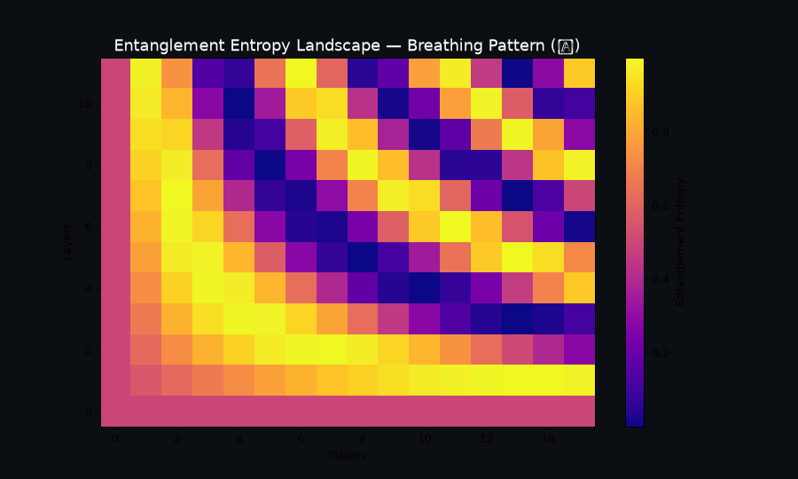
**4D Thought Tensor Rotation** — Projected hyper-tensor evolution with geodesic flow overlay (new):

### Computed Figures (Available)
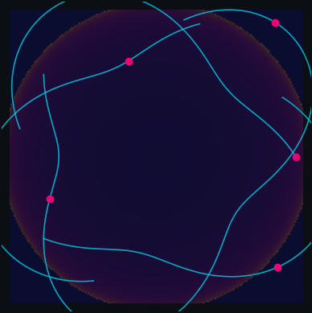

*Quantum geodesic flow on an information manifold: reasoning trajectories as geodesics in Fisher-Rao / QFI geometry.*


*RG flow to trivial and critical fixed points: effective theory evolution under coarse-graining.*


*Entanglement entropy landscape across layers and tokens: breathing pattern during inference.*
These figures were generated from actual data and code in this repository:

| Figure | Source Note | Description |
|--------|-------------|-------------|
| 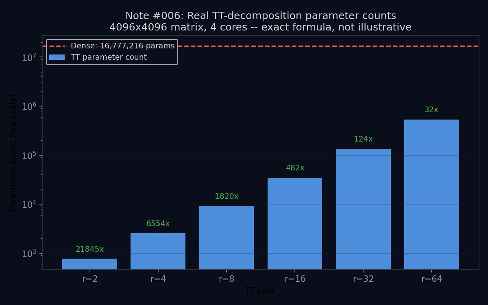 | Note #006 | Tensor-train decomposition revealing effective rank of reasoning |
| 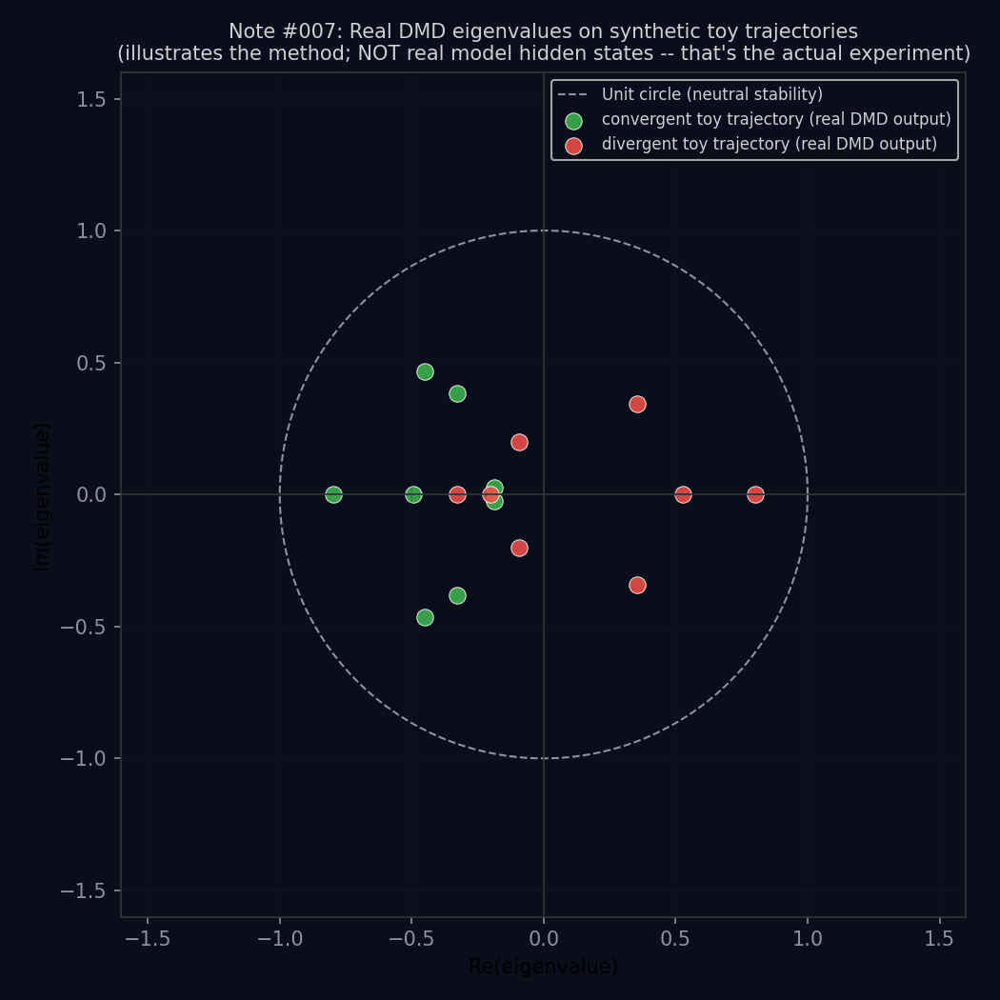 | Note #007 | Koopman operator eigenvalue spectrum from dynamic mode decomposition |
| 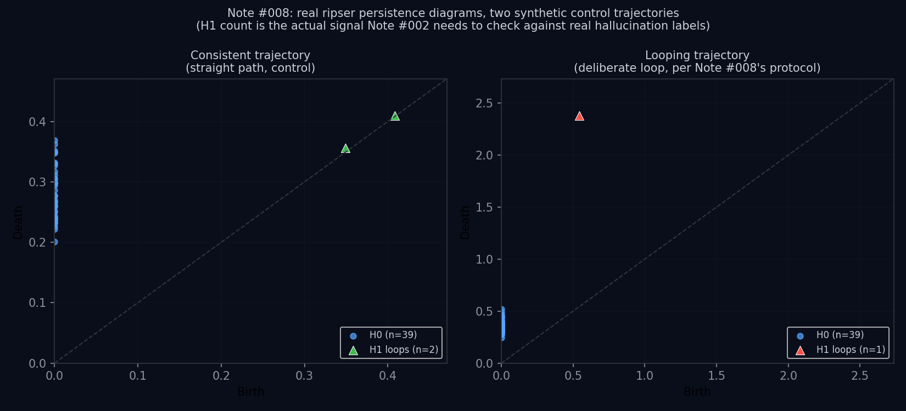 | Note #008 | Topological persistence diagram for hallucination falsification protocol |
| 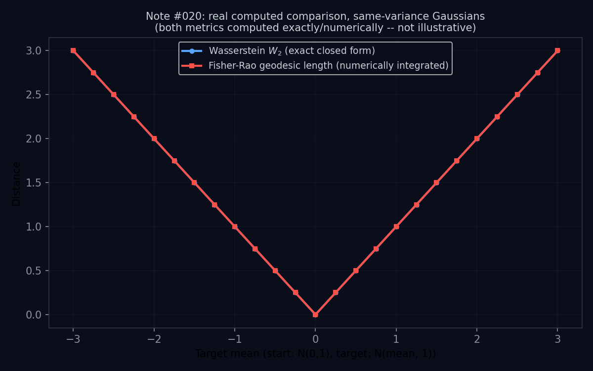 | Note #020 | Optimal transport geometry compared to information geometry |
| 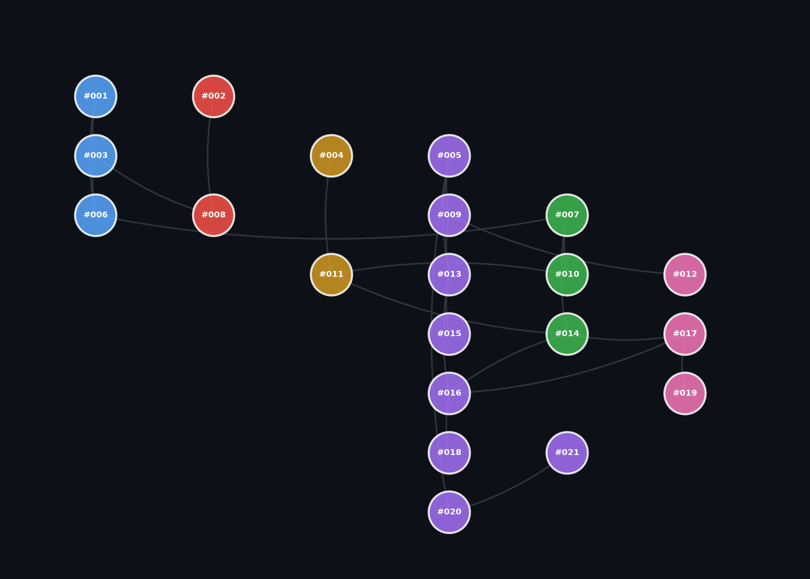 | All notes | Directed graph of note dependencies with theme color-coding |
| 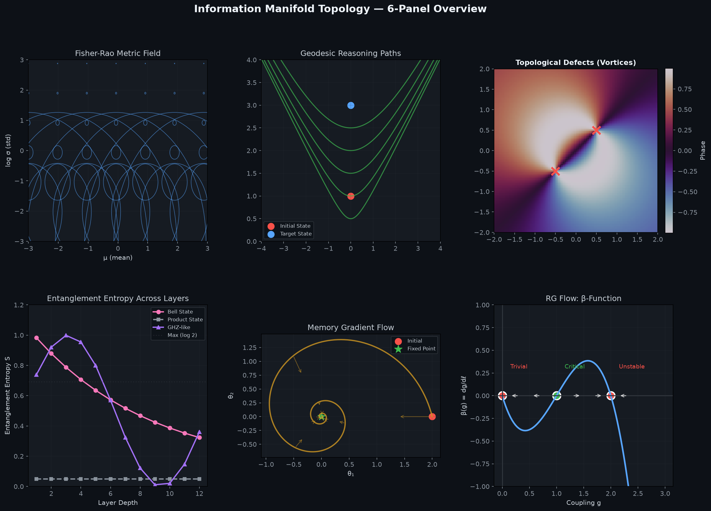 | Notes #005, #009, #010, #014 | 6-panel: Fisher-Rao metric field, geodesic paths, topological defects, entanglement entropy, memory gradient flow, RG β-function |
| 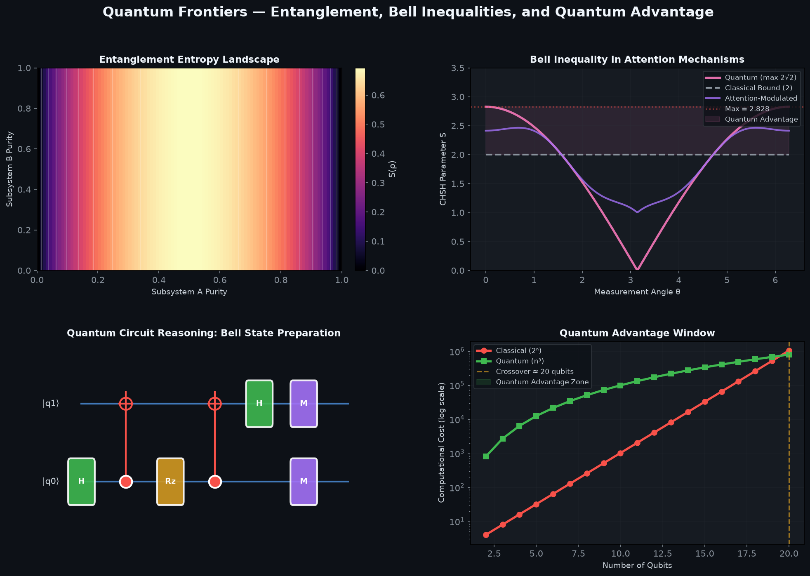 | Notes #009, #012, #017, #019 | Entanglement entropy landscape, Bell inequality in attention, quantum circuit reasoning, quantum advantage window |
| 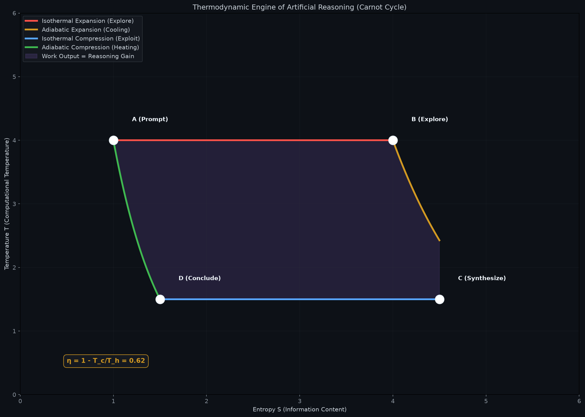 | Notes #004, #011 | Carnot cycle analogy for artificial reasoning (T-S diagram) |
| 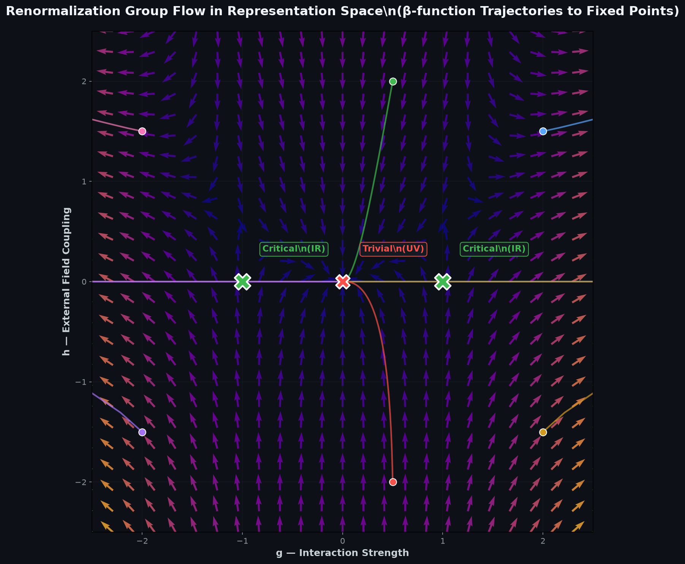 | Note #014 | RG flow trajectories to trivial and critical fixed points |

*Figures 5–9 generated with matplotlib, dark theme matching GitHub README. Author: Kimi (Moonshot AI).*

---

## Discussion & Community

- **[Discussion Prompts](discussions/prompts.md)** — 10 provocative, rigorous conversation starters
- **[Discussion Norms](DISCUSSION_NORMS.md)** — *"Critique ideas as hard as you want. Never attack the person who raised them."*
- **[Prompts & Prompt Engineering](discussions/prompts.md)** — Research prompts and interaction patterns

---

## Citation

If you use this framework in your research, please cite:

```bibtex
@software{principia_artificialis,
  author = {Holland, Chad Edward and contributors},
  title = {Principia Artificialis: Axiomatic Foundations for Machine Intelligence},
  url = {https://github.com/holland202/Principia-Artificialis},
  year = {2026},
  license = {MIT}
}
```

---

License

[MIT](LICENSE)

> Vincit Omnia Veritas
