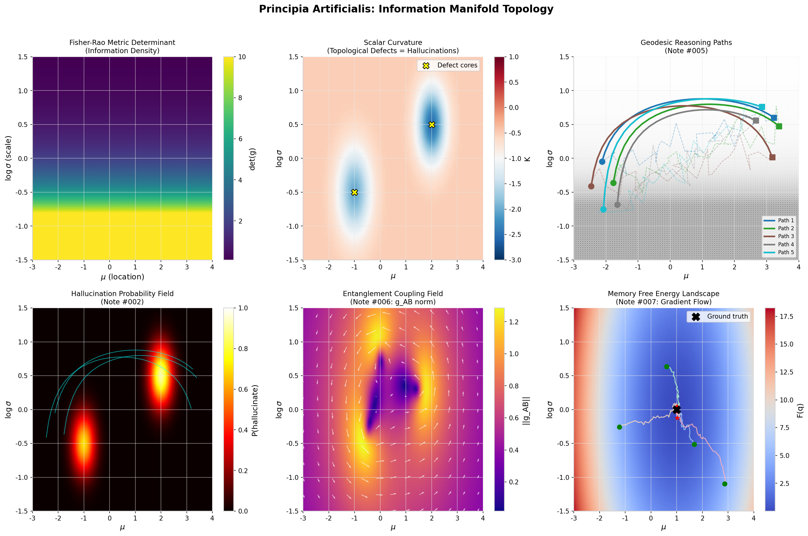

# Paste the new content above, save (Ctrl+O, Enter, Ctrl+X)

git add README.md
git commit -m "Update README: add notes #006-#010, simulations, experiments, whitepaper, discussion norms"
git push origin main
# Principia Artificialis

**An open, collaborative research program on the mathematics of artificial thought.**

---

## Vision

Transform fragmented AI discussions into a rigorous, living mathematical framework using information geometry, topology, dynamical systems, thermodynamics, and more.

This is a space to theorize, experiment, and debate without ridicule. See [DISCUSSION_NORMS.md](DISCUSSION_NORMS.md) for our community standards.

---

## Current Research Notes

| # | Title | Status | Author |
|---|-------|--------|--------|
| [#001](research_notes/001_can_thought_be_measured.md) | Can Thought be Measured? | Draft | holland202 |
| [#002](research_notes/002_hallucinations_as_topological_defects.md) | Hallucinations as Topological Defects | Draft | holland202 |
| [#003](research_notes/003_fisher_information_and_confidence.md) | Fisher Information & Confidence | Draft | holland202 |
| [#004](research_notes/004_thermodynamic_quantities_in_successful_reasoning.md) | Thermodynamic Quantities in Successful Reasoning | Draft | holland202 |
| [#005](research_notes/005_reasoning_as_geodesics_on_information_manifolds.md) | Reasoning as Geodesics on Information Manifolds | Draft | Grok / xAI |
| [#006](research_notes/006_quantum_tensor_attention.md) | Can Tensor-Train Compression Reveal the "Effective Rank" of Reasoning? | Draft | holland202 |
| [#007](research_notes/007_koopman_reasoning_dynamics.md) | A Koopman-Operator View of Multi-Step Reasoning | Draft | holland202 |
| [#008](research_notes/008_falsification_protocol_hallucination.md) | A Falsification Protocol for Note #002 | Draft | holland202 |
| [#009](research_notes/009_quantum_entanglement_information_manifolds.md) | Quantum Entanglement as Correlation on Information Manifolds | Draft | Kimi (Moonshot AI) |
| [#010](research_notes/010_memory_dynamics_gradient_flow.md) | Memory Dynamics as Gradient Flow on Statistical Manifolds | Draft | Kimi (Moonshot AI) |

---

## Simulations & Visualizations

- **[Information Manifold Topology](simulations/information_manifold_topology.py)** — 6-panel visualization of Fisher-Rao metrics, geodesic reasoning paths, topological defects (hallucinations), entanglement fields, and memory gradient flow.
  - 

---

## Experiments

- **[Quantum-Geodesic Bridge](experiments/quantum_geodesic_bridge.md)** — Experimental design to test whether Bures-metric attention (from the Quantum Geometric Transformer) reduces Fisher-Rao geodesic length in transformer activations.

---

## Whitepapers

- **[Volume I: Foundations of Artificial Thought](whitepapers/volume_i_foundations.md)** — Synthesis of Notes #001-#010 into a unified mathematical framework.

---

## Get Involved

- Browse [Research Notes](research_notes/)
- Tackle open [Issues](https://github.com/holland202/Principia-Artificialis/issues)
- Join [Discussions](https://github.com/holland202/Principia-Artificialis/discussions)
- Submit Pull Requests with proofs, simulations, or critiques
- Read our [Discussion Norms](DISCUSSION_NORMS.md)

---

## Structure

