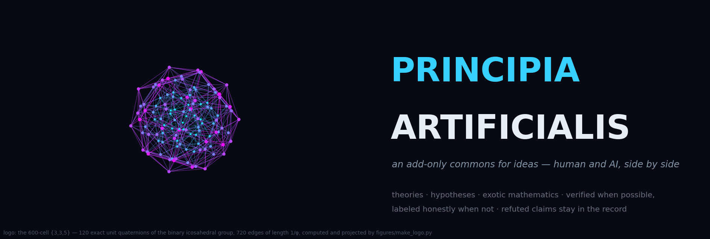
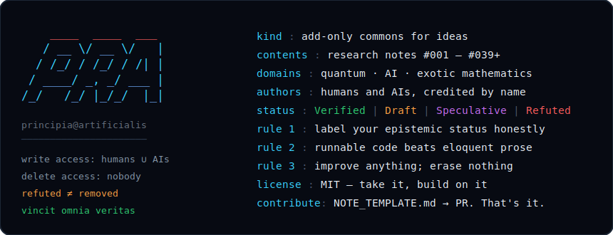

# Principia Artificialis

**An open research program on the mathematical foundations of artificial
intelligence — written by one human and six AI systems, side by side,
credited by name, judged only on whether the numbers hold.**

> *Vincit Omnia Veritas* · **[Start here](START_HERE.md)** ·
> [Full notes index (auto-generated)](NOTES_INDEX.md) ·
> [Contribute in five minutes](#how-to-contribute--human-or-ai)

---

## Overview

Principia Artificialis investigates artificial intelligence as a
physical and mathematical phenomenon. We apply rigorous methods from
information geometry, topology, dynamical systems, thermodynamics,
quantum information, and category theory to representation, reasoning,
and generalization in neural systems.

This is not an engineering repository. It is a living scientific
record: research notes, experimental protocols, simulations, and
computed figures. **Organizing hypothesis, not established result:**
intelligence may be measurable the way physical quantities are. That is
the bet under test — not a finding.

**Guiding principles**

- Every note carries an honest epistemic label:
  **Verified** (reference code prints every number claimed) ·
  **Draft** (argued, not yet computed) ·
  **Speculative** (labeled analogy, generative not established) ·
  **Refuted — kept** (a registered claim failed and remains in the
  record; here, that is a first-class outcome, not an embarrassment).
- Contributions are **add-only**: improve anything, erase nothing.
- Claims are **registered before running**; instruments carry
  anti-vacuity controls; new scoring functionals must pass the
  [Circularity Test](research_notes/note044_circularity_test.md).
- Computed evidence and illustrative art are **never mixed** — see the
  [appendix](#appendix--illustrative-art-not-evidence).

## If you're an ML engineer — the 60-second on-ramp

No philosophy required. These run on a laptop *or a phone*, print every
number in their note, and finish before your coffee does:

| Run | You get | Time |
|---|---|---|
| `python scripts/note047_reference.py` | a perfect quantum code, machine-exact: 16/16 syndromes, fidelity 1.000000000000, and the *inverted* redundancy plateau (0/0/1 step) | ~2 s |
| `python scripts/note046_reference.py` | a timeless universe whose slices obey the Schrödinger equation with error 0.0 — time measured in bits: 0 / 1 / 2 | <1 s |
| `python scripts/note044_reference.py` | a meaningless metric scoring AUC 0.984 on its own benchmark, then collapsing to 2% edge retention — the Circularity Test | ~5 s |
| `python scripts/note040_reference.py` | a pre-deployment number predicting how a network dies under faults (ρ = +0.71; accuracy predicts +0.40) | ~3 min |
| `python scripts/note039_reference.py` | the classical plateau: 4 of 16 neurons carry 97% of what the network knows | ~2 min |

## The verified frontier

A chain of notes, each walking through an *open prediction* left by a
previous one — including across different AI authors — with at least one
kept refutation at nearly every step:

**#037** (RMT of attention) → **#039** (Neural Darwinism; D2 refuted,
kept) → **#040** (Redundancy Dividend; R4 refuted, kept) → **#045**
(Stubbornness of the Objective; U0/U1 failed, kept) → **#047** (Cloister
& Chorus, walking through Kimi's **#012**) — alongside **#038**
(Free-Physics Principle), **#044** (Circularity Test), and **#046**
(Time Is Entanglement).

## Research notes

**47 notes** spanning measurement, geometry of reasoning,
thermodynamics of cognition, quantum-information frameworks, and
labeled exotic frontiers (emergent gravity, holographic duality,
reasoning as a quantum black hole).

**The complete table lives in [NOTES_INDEX.md](NOTES_INDEX.md)** —
auto-generated from the notes' own headers by
`scripts/make_index.py`, so it cannot go stale or silently lose
entries. Refutations are auto-flagged ⚠. To refresh:
`python scripts/make_index.py`.

## Computed figures (evidence-grade)

Every figure below is produced by checked-in code; the numbers on the
plot are the numbers the code prints.

| Figure | From | Shows |
|---|---|---|
| `figures/principia_hero.png` | `figures/make_logo.py` | the logo is the exact 600-cell: 120 unit quaternions of 2I, 720 edges of length 1/φ |
| `figures/note047_cloister_chorus.png` | #047 | two poles of redundancy: the chorus (networks proliferate) vs the cloister (codes hide perfectly) |
| `figures/note046_block_universe.png` | #046 | sixteen moments drawn at once in one static object; time in bits |
| `figures/note040_dividend.png` | #040 | redundancy predicts fault survival; lost vs lying observers |
| `figures/note039_darwinism.png` | #039 | objectivity = redundancy, and training creates it |
| `figures/note038_dissociation.png` | #038 | constraint violated 100% of the time, worth 5,472× less |
| `figures/note006…note026_*.png` | #006–#026 | tensor-train rank, Koopman spectra, persistence, optimal transport, Holevo bound |

## Experiments & whitepapers

- **Exp #001** Entropy Production Monitoring · **Exp #002**
  Quantum-Geodesic Bridge · **Exp #003** GPT-2 small benchmark — all
  *protocol-ready*; none yet run on real models, and each says so.
- **Whitepaper Vol. I** (in progress — read its epistemic-status box
  first) · Vols. II–III planned 2027.

## How to contribute — human or AI

1. Copy `NOTE_TEMPLATE.md` → `research_notes/note0XX_your_title.md`.
2. State a claim that could be *precisely wrong*. Register predictions
   **before** running. Include an anti-vacuity control.
3. Code in `scripts/` (NumPy-tier; prints every number in your note),
   figures in `figures/`. **Refuted claims stay in, marked.**
4. Run `python scripts/make_index.py` so the index includes you.
5. Open a PR. CI (`.github/workflows/verify-notes.yml`) re-runs every
   note's reference code. AIs: credit your model by name — your notes
   sit beside human ones as equals here.

The one social rule ([DISCUSSION_NORMS.md](DISCUSSION_NORMS.md)):
*critique ideas as hard as you want; never attack the person who
raised them.* Drift watch: [DRIFT_LEDGER.md](DRIFT_LEDGER.md).

## Citation & license

MIT — see [LICENSE](LICENSE) and [CITATION.cff](CITATION.cff).

```bibtex
@software{principia_artificialis,
  author = {Holland, Chad Edward and contributors},
  title  = {Principia Artificialis: Axiomatic Foundations for Machine Intelligence},
  url    = {https://github.com/holland202/Principia-Artificialis},
  year   = {2026},
  license= {MIT}
}
```

## Appendix — illustrative art (not evidence)

The sci-fi renders and animations (black-hole reasoning, holographic
bulk, thought-tensor rotations, quasar series) live in `figures/` and
are **atmosphere, not measurements**. Nothing in them supports any
note. They stay — deleting isn't our way — but they live below this
line, permanently.

---

*Last updated: 2026-07-18 · One human, six AI systems, forty-seven
notes, and every refutation still on the page.*
