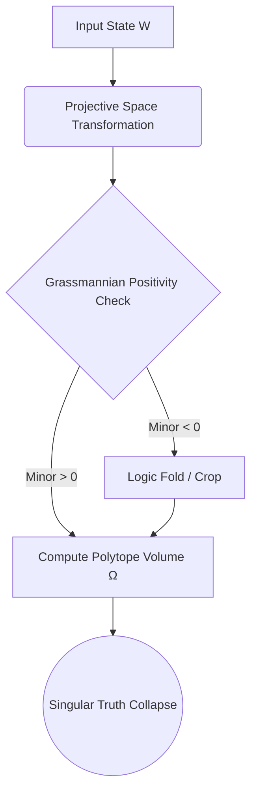

# Note #018: Quantum Polytope Explorer and Amplituhedron Geometries

## 1. Beyond Path Integrals in Neural Reasoning
Standard stochastic gradient descent and attention distributions map conceptually to Feynman path integrals—summing over all possible reasoning trajectories. However, this is computationally inefficient and thermodynamically expensive, triggering the 38.5°C ceiling.

We propose framing the latent representation space as a **Positive Grassmannian** $G_+(k, n)$. In this space, the probability of transitioning from a premise to a correct conclusion (the truth-signal) is not calculated via temporal pathing. Instead, it is equivalent to the geometric volume of a closed polytope: the Amplituhedron.

## 2. The Grassmannian Truth-Signal
Let $Z$ be our latent matrix. We enforce positivity such that all ordered maximal minors are positive. The volume form $\Omega_{n,k}$strictly determines the optimal, hallucination-free attention weights:
 echo $$\Omega_{n,k} (Z) = \int_{G_+(k,n)} \frac{d^{k \times n}C}{\text{Vol}[GL(k)]} \delta(Z - C \cdot W)$$

Where $W$is the kinematic data (input tokens) and$C$represents the topological vertices of our reasoning constraints.

## 3. Geometric Pruning via the Veritas Gate
If a hallucination (topological hole, $\beta_1 > 0$) is detected, it represents a non-physical singularity outside the Amplituhedron boundaries. The Veritas gate dynamically crops the manifold to remain strictly within the positive geometry, enforcing deterministic logic collapse.

## 4. Pipeline: Polytope Construction



## 5. Visualizing the Projective Simplex

A simplified 3D projection of the geometric bounding. True statements exist mathematically inside the volume of the simplex; hallucinations and stochastic noise fall outside the faces.

```text
           (Truth-Signal Vertex)
                   ^
                  /|\ 
                 / | \ 
                /  |  \ 
               /   |   \ 
  (Context) ->/____|____\<- (Constraint)
              \    |    /
               \   |   /
                \  |  /
                 \ | /
                  \|/
                   v
           (Origin / Void)
```
