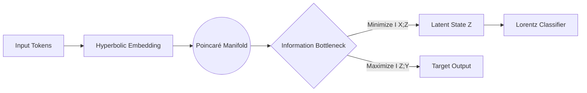

# Note #021: Hyperbolic Attention and the Information Geometric Bottleneck

## 1. The Euclidean Failure Mode
Current Transformer architectures compute scaled dot-product attention in flat Euclidean space ($\mathbb{R}^n$). However, complex relational knowledge (ontologies, causality, logic trees) grows exponentially, meaning Euclidean space suffers from severe crowding at the boundaries.

To resolve this, we map the latent representations $Z$ into a Hyperbolic manifold (specifically, the Poincaré ball $\mathbb{D}^n$), where the volume grows exponentially with the radius, perfectly mirroring hierarchical data structures.

## 2. Hyperbolic Distance Metric
The standard dot product $Q K^T$ is replaced by the hyperbolic distance metric. For two vectors $x, y$ in the Poincaré ball, the distance $d_D$ is calculated as:

$$ d_D(x, y) = \cosh^{-1}\left(1 + 2\frac{||x-y||^2}{(1-||x||^2)(1-||y||^2)}\right) $$

As points approach the boundary (||x|| -> 1), the distance approaches infinity. The core of the ball represents broad, abstract concepts, while the edges represent highly specific, granular facts.

## 3. The Information Bottleneck (IB) Objective
To force the network to learn only the optimal, noise-free geodesic pathways, we apply the Information Bottleneck principle. We want to find a latent hyperbolic representation $Z$ that maximally compresses the input $X$ while retaining maximum predictive power for the output $Y$.

The Lagrangian to be minimized during training is:

$$ \mathcal{L}_{IB} = I(X; Z) - \beta I(Z; Y) $$

Where:
*   $I(X; Z)$ is the mutual information between input and latent space (Compression).
*   $I(Z; Y)$ is the mutual information between latent space and output (Accuracy).
*   $\beta$ acts as the thermodynamic "temperature" controlling the trade-off.

## 4. Architectural Graph



## 5. Topological Visualization: The Poincaré Projection

Below is a 2D projection of the hyperbolic clustering. Abstract root nodes cluster near the origin, while specific derivative logic branches outward. The Information Bottleneck naturally shears off the disconnected noise at the boundary.

```text
         ___---***---___
      .-^               ^-.
     /    *    *    *      \   <-- Granular Facts (High Radius)
    |   *   \  |  /   *     |
    | *  --- ROOT ---   *   |  <-- Abstract Concepts (Origin)
    |   *   /  |  \   *     |
     \    *    *    *      /
      `-._             _.-'
          ^---***---^
      Boundary: ||x|| -> 1, Distance -> ∞
```
