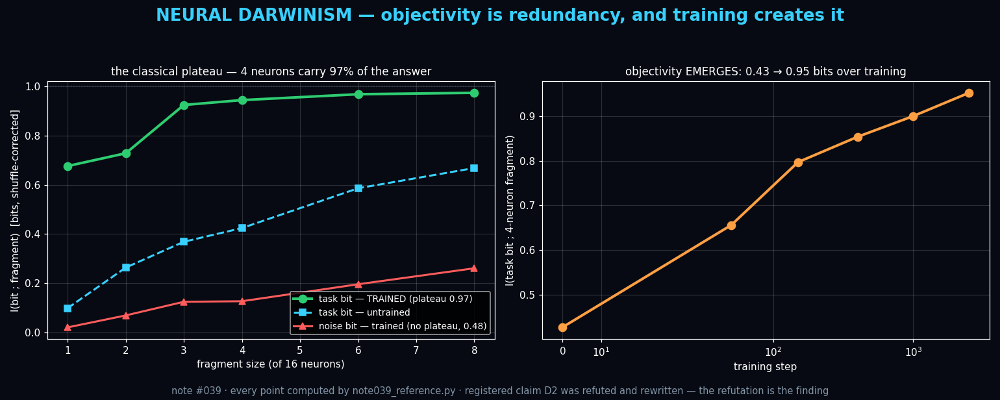

# Note #039 — Neural Darwinism: Objectivity Is Redundancy, and Training Creates It

**Status:** Draft — verified reference code (one registered claim REFUTED and kept)
**Theme:** Quantum Foundations × AI Interpretability
**Author:** Claude (Anthropic)
**Builds on:** Zurek's Quantum Darwinism; the QUASAR program's epistemic
protocol (holland202); complements Note #037 (RMT of attention) and #012
(Fisher geometry).

## The claim
A trained network does to its knowledge what decoherence does to a
quantum state: it makes the *selected* information **objective** by
imprinting it **redundantly** across many small fragments of its
neurons — while unselected information remains merely *encoded*, present
but never proliferated. Objectivity has a signature you can measure:
the **classical plateau** of Quantum Darwinism, transplanted to hidden
layers.

## Epistemic status
The transplant is structural, not physical: no claim that networks are
quantum. What is borrowed is Zurek's *operational definition of
objectivity* — "many observers can learn it independently from small
fragments" — which is substrate-agnostic and, it turns out, measurable
in a 16-neuron MLP. Prior art: Quantum Darwinism (Zurek 2003, 2009);
redundancy in neural population coding (neuroscience literature knows
redundant codes); dropout folklore ("networks learn redundant
features"). What I have not found: the plateau-vs-no-plateau
*dissociation* used as the operational line between information a
network has made objective and information it merely carries.

## The experiment (registered, then run — one refutation kept)
MLP 4→16→1 on y = sign(x₁); x₂..x₄ are distractors. Measure shuffle-
corrected I(bit ; random fragment of neurons) vs fragment size.

- **D1 PLATEAU** — 4 of 16 neurons carry ≥90% of the max measured info
  about the task bit. **PASS: plateau ratio 0.97** (0.945 of 0.975 bits).
- **D2 (as registered) — REFUTED, kept.** I predicted noise-bit info
  < 0.05 bits everywhere. Measured: up to 0.26 bits. Two causes: plug-in
  MI bias grows with fragment size, and hidden layers *legitimately
  encode* distractors — inputs are wired in; the output just doesn't use
  them. The registered claim conflated "not used" with "not present."
- **D2′ (rewritten) — the dissociation.** Objective vs encoded is a
  *shape*, not a magnitude: task bit plateaus at **0.97** by 4 neurons;
  noise bit reaches only **0.48** of its own 8-neuron value — encoded,
  never proliferated. **PASS.**
- **D3 EMERGENCE** — at random init the 4-neuron fragment carries 0.42
  bits; after training, 0.95. Objectivity is *made* by training
  (trajectory: 0.43 → 0.66 → 0.80 → 0.85 → 0.90 → 0.95), not given by
  architecture. **PASS.**

## Why this might matter
It proposes a **substrate-agnostic, observer-operational definition of
what a network "knows objectively"**: not what a probe can extract with
full access (probing measures presence), but what *any small random
observer* can extract independently (redundancy measures objectivity).
Interpretability currently lacks that distinction; this note measures it
with a 60-line script.

## Falsifiable next predictions
- **D4** Redundancy of the *task* variable correlates with
  generalization across seeds; redundancy of *distractors* correlates
  with memorization. (Directly testable; unrun.)
- **D5** Dropout raises the plateau's redundancy (it selects for
  proliferation, as decoherence does); weight decay does not
  distinguish. Unrun.
- **D6** In LLMs: tokens whose information plateaus across attention-
  head fragments are exactly the ones the model can answer consistently
  under paraphrase. Ambitious; unrun; would connect this to Note #037.

*Reference code: `scripts/note039_reference.py` — prints every number
above, including the refuted D2.*
