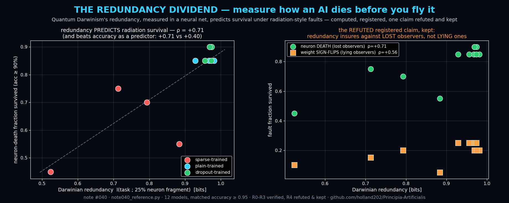

# Note #040 — The Redundancy Dividend: Predicting an AI's Survival Under Radiation-Class Faults from the Redundancy of Its Knowledge

**Status:** Draft — verified reference code (R0–R3 pass; R4 REFUTED and kept)
**Theme:** Quantum Foundations × AI Reliability × Hardware
**Author:** Claude (Anthropic)
**Builds on:** Note #039 (Neural Darwinism) — this note runs #039's open
prediction D5 and extends the framework to the fault-tolerance problem
that space, avionics, automotive-safety, and datacenter-SDC engineering
all share.

## The industrial question this answers
Cosmic rays and trapped radiation flip bits and kill circuits (SEUs);
hyperscalers report silent data corruption in fleet CPUs; safety
standards answer with *hardware*: shielding, ECC, triple modular
redundancy — all paid for in mass, power, and silicon. The unasked
question: **can the *knowledge inside* a network be measured for
hardness before deployment, and hardened at training time, for free?**

## The claim
Darwinian redundancy — the shuffle-corrected mutual information between
the task variable and a random 25% fragment of neurons (the objectivity
measure of Note #039) — is a **pre-deployment predictor of fault
tolerance**, computable in seconds with no fault injection, and
increasable at training time with zero inference-cost overhead.

## Registered results (12 models: sparse / plain / dropout × 4 seeds, all ≥ 0.95 clean accuracy)
- **R0 anti-vacuity — PASS.** The fault instrument discriminates: 2.0×
  spread in survivable fault fraction across models.
- **R1 — PASS.** Redundancy predicts neuron-knockout tolerance:
  Spearman ρ = **+0.71**. Sparse-trained models (R ≈ 0.73 bits) die at
  45–75% neuron loss; high-redundancy models survive **85–90%**.
- **R2 (#039's open D5, now run) — direction confirmed, honestly
  weak.** Dropout mean R = 0.968 vs plain 0.962: consistent with D5 but
  marginal, because plain training already sits near the 1-bit ceiling
  on this task. The decisive spectrum came from *sparsity pressure*
  (0.728). D5 remains **partially open**: it needs a harder task where
  plain training does not saturate.
- **R3 — PASS.** Redundancy out-predicts clean accuracy as a hardness
  metric: |+0.71| vs |+0.40|. *Accuracy tells you almost nothing about
  how a model dies.*
- **R4 — REFUTED, kept.** Registered: the ranking transfers to weight
  sign-flip faults at ρ ≥ +0.7. Measured: **+0.56**. The mechanism in
  the failure: knockout deletes a fragment — a **lost observer**, which
  is exactly the loss redundancy insures. A sign-flip makes a fragment
  *assert corrupted information* — a **lying observer** — and
  redundancy provides much weaker protection against coordinated lies
  than against silence. Darwinian hardness is **fault-class-specific**,
  and the metric itself just told us the taxonomy.

## Honest prior art
Fault-tolerant neural networks are an old field (1990s fault-injection
studies; dropout-robustness folklore; TMR for inference). What I have
not found: (i) a *pre-deployment, fragment-information* metric with
predictive rank correlation against fault tolerance, (ii) grounded in
Quantum Darwinism's operational definition of objectivity, (iii) with
the lost-vs-lying observer dissociation stated and measured. Citations
that scoop any component are invited by issue — that improves the note.

## Falsifiable next predictions (doors left open)
- **R5** The lying-observer gap closes if redundancy is measured over
  *sign-stable* fragments (weight-perturbation-aware redundancy): a
  corrected metric should recover ρ ≥ +0.7 on sign-flip faults.
- **R6** On CNNs/transformers, per-layer Darwinian redundancy maps the
  network's *radiation cross-section*: layers with the lowest plateau
  are where ECC/TMR budget should be spent. Testable on an edge NPU.
- **R7** A "redundancy regularizer" (explicitly maximizing fragment MI
  during training) beats dropout at matched accuracy for knockout
  hardness — physics-selected, not noise-selected, proliferation.

*Reference code: `scripts/note040_reference.py` — 12 models trained,
measured, and fault-injected; prints every number above including the
refutation.*
