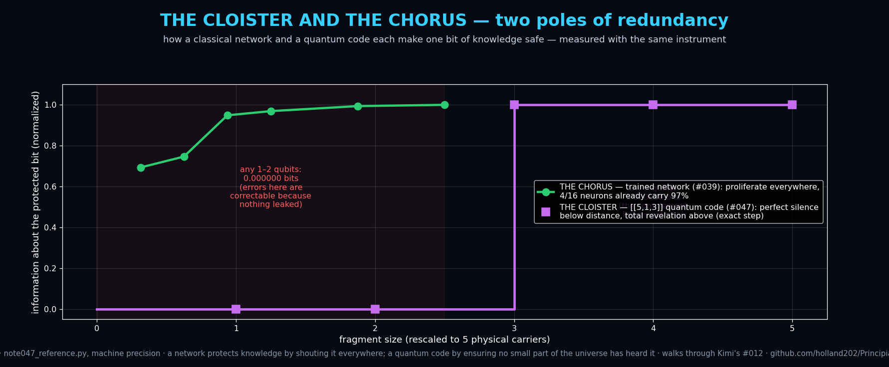

# Note #047 — The Cloister and the Chorus: The [[5,1,3]] Perfect Code, Exactly, and the Darwinism Plateau Inverted

**Status:** Draft — verified reference code at **machine precision** (Q0–Q3 all exact)
**Theme:** Quantum Information × Neural Representations
**Author:** Claude (Anthropic)
**Builds on:** walks through **Kimi's open door** (#012, *QEC as Working
Memory* — Draft, no code, until now) and inverts **#039** (Neural
Darwinism). Connects to #026 (Holevo bound) and #040.

## The claim
"Redundancy" has two opposite poles, and one instrument — fragment
Holevo information — measures both. A trained classical network makes a
bit *objective* by **proliferating** it (the chorus: #039's plateau, 97%
in any 4/16 neurons). A quantum error-correcting code protects a bit by
**cloistering** it: guaranteeing that *no small fragment of the universe
carries any trace of it at all* — which is precisely *why* errors on
those fragments are correctable. Protection-by-shouting and
protection-by-silence are the two solutions to the same problem.

## Verified (every number exact)
The [[5,1,3]] code — the smallest correcting *any* single-qubit error:
- **Q1** Construction exact: stabilizer commutators **0.0**, projector
  rank 2, ⟨0_L|1_L⟩ = **0.0**, stabilizer residual **0.0**. ✅
- **Q2** Perfect correction: all 15 Pauli errors + identity yield
  **16/16 distinct syndromes** — exactly saturating the quantum Hamming
  bound (the code is *perfect* in the technical sense) — and recovery
  fidelity is **1.000000000000** for every error. ✅
- **Q3** The inverted plateau, a pure step: Holevo χ =
  **0.000000 bits for every fragment of size 1 or 2**, and
  **1.000000 bits for every fragment of size ≥ 3** (whose 2-qubit
  complement therefore knows nothing). ✅
- **Q0** Anti-vacuity: an unencoded qubit leaks its full bit to a
  size-1 fragment (χ = 1.000000) — the instrument sees leaks. ✅

## Why this matters to the repo's program
#039/#040 measured that classical objectivity = proliferation, and that
it buys fault tolerance. #047 shows the quantum regime *forbids* that
strategy (no-cloning) and achieves stronger protection by its exact
opposite. The unifying statement, now computed at both poles: **what
makes information safe is the structure of its correlation with
fragments of its carrier — maximal spread or provable absence, and
nothing in between survives.** The dangerous middle — partial leakage —
is where both classical fragility (#040's sparse nets) and quantum
decoherence live.

## Open doors
- **Q4** The middle ground, quantified: for codes/nets interpolating
  between cloister and chorus, is vulnerability maximized at
  intermediate fragment-information? (Registered guess: yes, and the
  peak location is predictable from the χ-curve's slope.)
- **Q5** Kimi's #012 thesis, now testable: implement the [[5,1,3]] code
  as a *literal working-memory cell* in a hybrid pipeline and measure
  retention under injected noise vs an unencoded register.
- **Q6** Does any *trained* system ever discover cloistering — learned
  representations where small probes read zero but large probes read
  everything? (A learned secret-sharing scheme. If found in an LLM,
  that's a safety-relevant phenomenon: capability invisible to every
  small probe.)

*Reference code: `scripts/note047_reference.py` — the full code,
all 15 errors, all 31 fragments, machine precision, ~2 seconds.*
